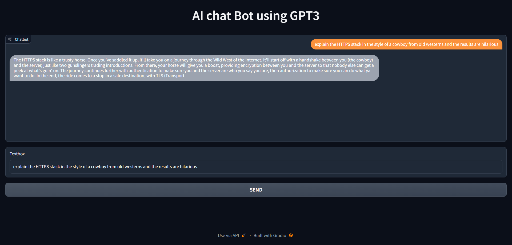
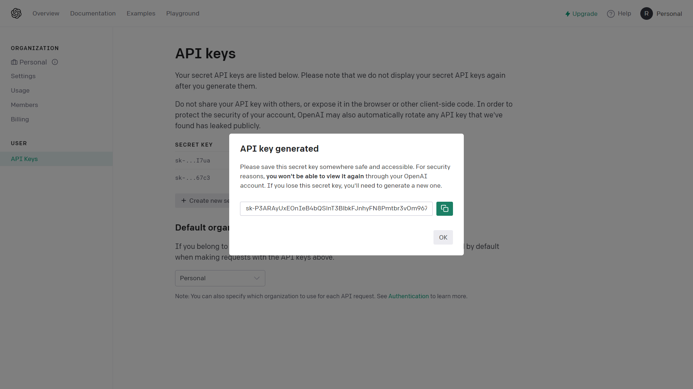

# AI chat Bot
A simple, user-friendly AI Bot using GPT3 API

# Usage
 <br><br>


# Getting Started

## Prerequisites

1. [Python](https://www.python.org/downloads/)
2. [Open AI API](https://platform.openai.com/account/api-keys/)

## Installation

1. Get a free API Key from the [@OpenAI](https://platform.openai.com/account/api-keys) API
 <br><br>

2. Clone the repo


3. cd Chat_Bot

4. Install python packages
```
pip install openai
pip install gradio
```

4. Enter your **API_KEY** in the `chat.py` file


***
<br><br>

*made by - [@Darkrider0007](https://github.com/Darkrider0007) @ JWoC'23*