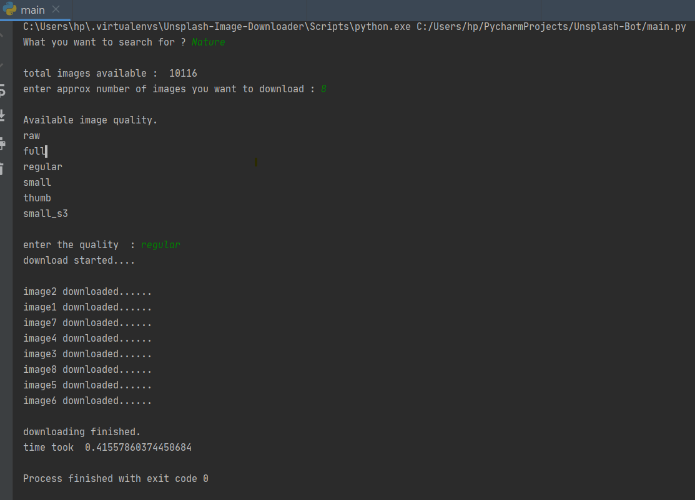

# Unsplash Image Downloader

Using this python script user can download any image from unsplash by providing search query.

#### How to use:
- First install all the requirements
`pip install requirements.txt`
- Run the main.py script
- then  follow the instruction as displayed on console

#### Preview:

