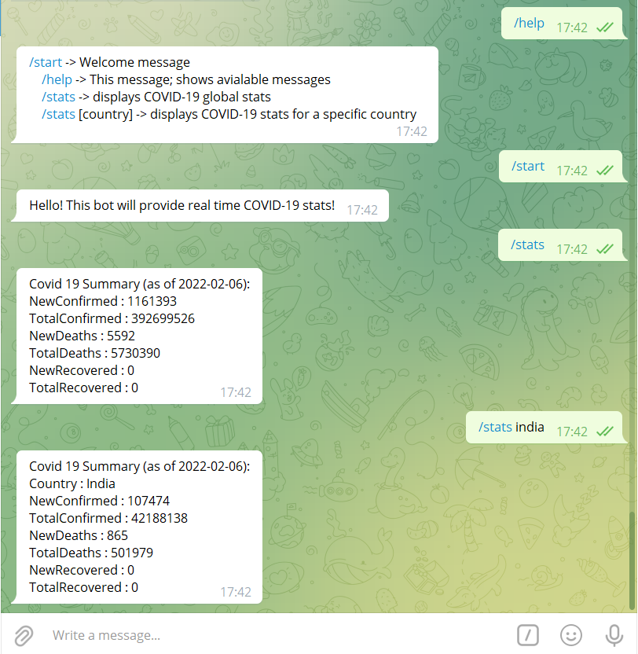

# Covid Bot
A simple telegram bot that provides users with up-to-date COVID-19 statistics.

# Usage
 <br><br>


# Getting Started

## Prerequisites

1. [Python](https://www.python.org/downloads/)
2. [Telegram Desktop](https://desktop.telegram.org/)

## Installation

1. Get a free API Key from the @BotFather Telegram Bot

2. Clone the repo
```
git clone https://github.com/neelshah2409/Bot-Collection.git

cd covid_bot
```
3. Install python packages
```
pip install -r requirements.txt
```

4. Enter your **BOT TOKEN** in the `.env` file
```
BOT_TOKEN="ENTER YOUR BOT TOKEN HERE"
```
***
<br><br>

*made by - [nlaieke](https://github.com/nlaieke)*

*edited by - [r3yc0n1c](https://github.com/r3yc0n1c) @ JWoC'22*